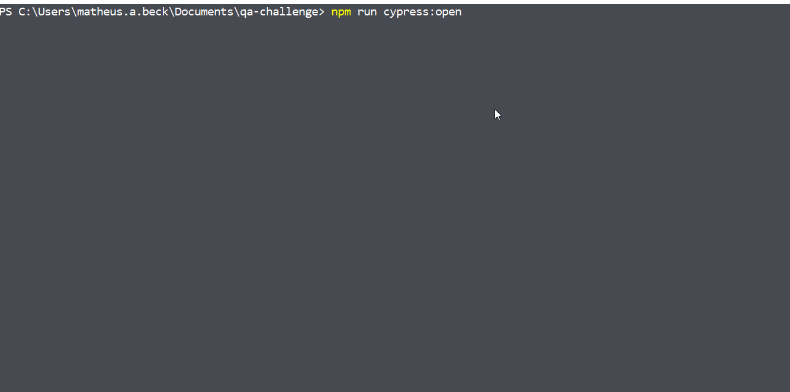

# QA Challenge

Cypress end-to-end test in an HTML page (`toTest.html`) for the tech quality assurance challenge from a company. The tests are inside `cypress/integration/cubos-challenge.spec.js`

## Tests execution demonstration



## Dev Dependencies Used

- "cypress": "^4.0.2"

## Getting Started

1. Clone the project into your machine and install all dependencies inside the `qa-challenge` folder using:

```console
npm install
```

2. Now, to run the test:

```console
npm run cypress:open
```

3. Click on `qa-challenge.spec.js` in the Cypress interface that was opened

---

Made with ❤️ by Matheus Beck 👋 [Get in touch!](https://www.linkedin.com/in/matheus-beck/)
